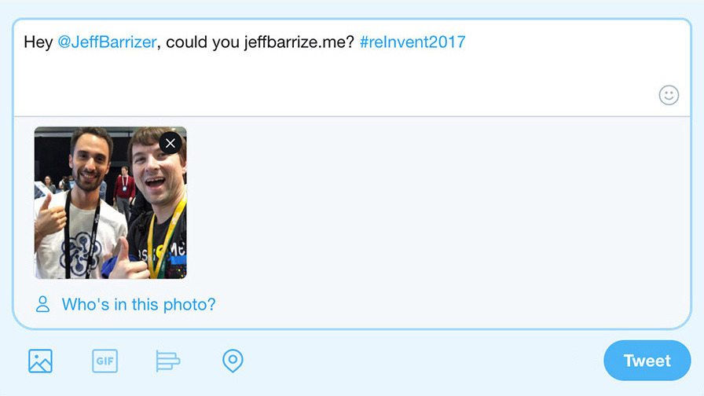

# JeffBarrizer Twitter Bot

You can find the [JeffBarrizer on Twitter](https://twitter.com/JeffBarrizer).

It will "jeffbarrize" any selfie you tweet at it.

Please be polite, it's just a friendly bot.

# How it works

The JeffBarrizer bot will respond to every tweet that contains an image, but it won't actually do much if the image doesn't contain a face, or if it's not SFW.

Here's how you can interact with it:

1. Take a great selfie (bonus if w/ Jeff)
2. Tweet it to [@JeffBarrizer](https://twitter.com/JeffBarrizer)
3. Wait for your JeffBarrized response

# How we built it

The JeffBarrizer is built with AWS services such as S3, Kinesis, Rekognition, and Lambda. It is 90% serverless, as it provisions an Auto Scaling Group only to elastically ingest the stream of Tweets into Kinesis.

Note: this repo is a fork and for the most part based on [Randall Hunt](https://twitter.com/jrhunt)'s work. You can find the original workshop material and the corresponding instructions here: [awslabs/aws-rekognition-workshop-twitter-bot](https://github.com/awslabs/aws-rekognition-workshop-twitter-bot).

# Additional Resources

* [JeffBarrizer on Twitter](https://twitter.com/JeffBarrizer)
* [JeffBarrizer's website (Live Stream)](https://jeffbarrize.me)

# Credits

The JeffBarrizer Bot is a weekend project, designed just for fun by [Alex Casalboni](https://twitter.com/alex_casalboni).

Made with :heart: in SF - Powered by 